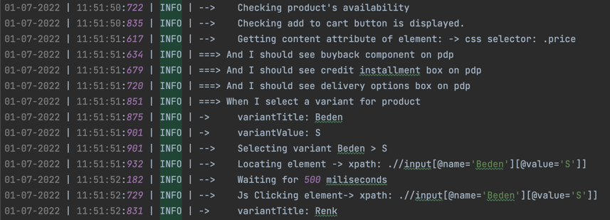
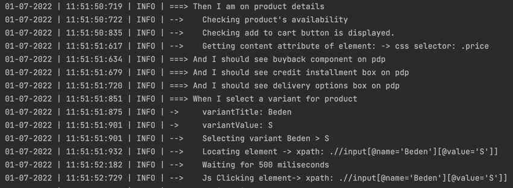

# Selenium Event Logger
This project provides log management for **Selenium** projects. It provides logging your Selenium events and scenarios based on **logback** library

#Usage

##Maven Dependency
        <dependency>
            <groupId>com.cankizilay.selogger</groupId>
            <artifactId>selenium-event-logger</artifactId>
            <version>$LATEST_VERSION</version>
        </dependency>
##Config file 
Project needs `events.properties` under `main/resources` for toggling the logs and other settings.

###Config settings

Example properties is: 

```
//Settings
logPath = logs

//WebDriver
beforeGet = true
beforeGetCurrentUrl = true
beforeGetTitle = true
beforeFindElement = true
beforeFindElements = true
beforeGetPageSource = true
beforeClose = true
beforeQuit = true
beforeExecuteScript=true

//WebElement
beforeClick = true
beforeSubmit = true
beforeSendKeys = true
beforeClear = true
beforeGetTagName = true
beforeGetAttribute = true
beforeIsSelected = true
beforeIsEnabled = true
beforeGetText = true
beforeIsDisplayed = true

//Navigation
beforeTo = true
beforeBack = true
beforeForward = true
beforeRefresh = true
```

##Driver Setup
Logger should be added to the driver.

Example: 

```
Webdriver driver = Logger.setLogger(new ChromeDriver());
```

##Log File

For test based logging, log file should be set before tests step.

```
Logger.setLogFilesName("My scenario");
```

It is recommended finishing tests with:

```
Logger.unsetLogFileName(My scenario);
```


##Logging steps


`Logger.setLogFilesName(String logFileName)`

`Logger.startTests (String testName)`

`Logger.finishTests (String testName)` 

`Logger.failed (String testName)` 

`Logger.info (String message)` 

`Logger.warning (String message)` 

`Logger.error (String message)` 

`Logger.testStep (String testStep)` 

`Logger.subStepLog (String substep)` 

`Logger.scenario (String scenatioName)` 

